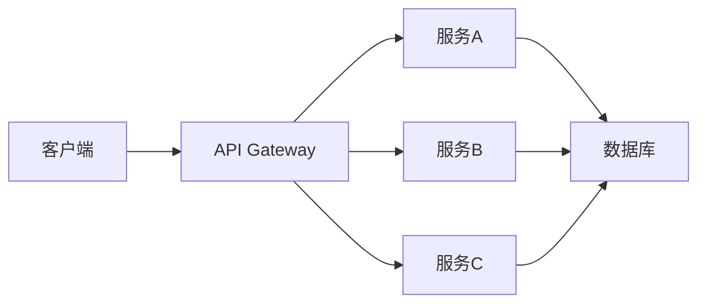

# 技术演讲标题

技术副标题或一句话描述

<div class="pt-12">
  <span @click="$slidev.nav.next" class="px-2 py-1 rounded cursor-pointer" hover="bg-white bg-opacity-10">
    开始演讲 <carbon:arrow-right class="inline"/>
  </span>
</div>

<div class="abs-br m-6 flex gap-2">
  <span class="text-sm opacity-50">Your Name · 2024</span>
</div>

---
layout: default
---

# 目录

<div class="grid grid-cols-2 gap-8">

<div>

## 📝 第一部分
- 背景和问题
- 为什么重要

## 🔧 第二部分
- 技术方案
- 架构设计

</div>

<div>

## 💻 第三部分
- 代码实现
- 最佳实践

## 🚀 第四部分
- 案例展示
- 总结和展望

</div>

</div>

---
layout: center
class: text-center
---

# 第一部分
## 背景和问题

---
layout: default
---

# 问题描述

当前面临的主要问题:

- **问题1**: 描述具体问题
- **问题2**: 分析影响范围
- **问题3**: 现有方案的局限

<div class="mt-8">

💡 **核心挑战**: 一句话总结核心挑战

</div>

---
layout: two-cols
---

# 为什么重要

<template v-slot:default>

## 业务影响

- 影响用户体验
- 增加维护成本
- 降低开发效率

## 技术债务

- 代码复杂度高
- 测试覆盖率低
- 扩展性差

</template>

<template v-slot:right>

<div class="pl-8">

## 数据支撑

<div class="mt-4 p-4 bg-blue-500 bg-opacity-10 rounded">

### 50%
性能下降

</div>

<div class="mt-4 p-4 bg-red-500 bg-opacity-10 rounded">

### 2x
开发时间增加

</div>

<div class="mt-4 p-4 bg-yellow-500 bg-opacity-10 rounded">

### 30%
Bug 率提升

</div>

</div>

</template>

---
layout: center
class: text-center
---

# 第二部分
## 技术方案

---
layout: default
---

# 解决方案概览

<div class="grid grid-cols-3 gap-4">

<div v-click class="p-4 border rounded">

### 1️⃣ 架构重构
采用微服务架构

</div>

<div v-click class="p-4 border rounded">

### 2️⃣ 技术选型
使用现代化技术栈

</div>

<div v-click class="p-4 border rounded">

### 3️⃣ 最佳实践
遵循工程规范

</div>

</div>

---
layout: default
---

# 架构设计



<div class="mt-4">

**关键点:**
- 服务解耦
- 独立部署
- 可扩展性

</div>

---
layout: center
class: text-center
---

# 第三部分
## 代码实现

---
layout: default
---

# 核心代码示例

```typescript {all|1-3|5-10|12-15}
// 定义接口
interface User {
  id: string;
  name: string;
}

// 实现服务
class UserService {
  async getUser(id: string): Promise<User> {
    return await this.repository.findById(id);
  }
}

// 使用示例
const user = await userService.getUser('123');
```

<arrow v-click="3" x1="400" y1="420" x2="230" y2="330" color="#564" width="3" arrowSize="1" />

---
layout: two-cols
---

# 最佳实践

<template v-slot:default>

## ✅ 推荐做法

- 使用 TypeScript
- 编写单元测试
- 代码审查
- 持续集成

</template>

<template v-slot:right>

## ❌ 避免做法

- 硬编码配置
- 忽略错误处理
- 过度设计
- 缺少文档

</template>

---
layout: center
class: text-center
---

# 第四部分
## 案例展示

---
layout: default
---

# 实际案例

## 案例1: 性能优化

<div class="grid grid-cols-2 gap-4 mt-4">

<div>

### 优化前
- 响应时间: 2s
- 吞吐量: 100 req/s
- CPU 使用: 80%

</div>

<div>

### 优化后
- 响应时间: 200ms ⚡
- 吞吐量: 1000 req/s 📈
- CPU 使用: 30% ✅

</div>

</div>

<div class="mt-6">

**改进方案:**
1. 缓存优化
2. 数据库索引
3. 异步处理

</div>

---
layout: center
class: text-center
---

# 总结

<div class="grid grid-cols-2 gap-8 text-left mt-8">

<div v-click>

## 🎯 核心要点

- 要点1: 关键技术
- 要点2: 最佳实践
- 要点3: 注意事项

</div>

<div v-click>

## 📚 后续行动

- 阅读文档
- 尝试实践
- 加入社区

</div>

</div>

---
layout: center
class: text-center
---

# Q & A

提问环节

<div class="mt-8 text-sm opacity-75">

📧 your.email@example.com  
🐦 @yourtwitter  
📝 yourblog.com  
💻 github.com/yourname

</div>

---
layout: end
class: text-center
---

# 感谢观看！

期待与你交流

